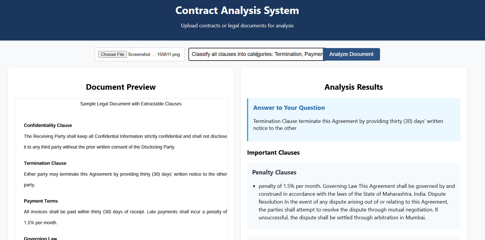

# LegalAI: Contract Analysis System

LegalAI is a powerful web application designed to help you analyze legal documents and contracts with ease. Powered by the DOLPHIN model for state-of-the-art Optical Character Recognition (OCR), this tool allows you to upload scanned documents or PDFs and receive a comprehensive analysis.



## Key Features

- **Advanced OCR**: Utilizes the DOLPHIN model to accurately extract text from images and multi-page PDFs.
- **Clause Extraction**: Automatically identifies and categorizes key clauses such as Termination, Payment Terms, Confidentiality, and more.
- **Risk Analysis**: Flags potentially risky terms or clauses within the document to draw your attention to important details.
- **Natural Language Q&A**: Ask questions about the contract in plain English and get direct answers based on the extracted text.
- **User-Friendly Interface**: A clean and intuitive web interface built with React for a smooth user experience.

## How It Works

The system follows a simple yet powerful workflow:
1.  **Upload**: You upload a document (image or PDF).
2.  **OCR Processing**: The backend converts the document into raw text using the DOLPHIN model.
3.  **Text Analysis**: The extracted text is then scanned using pattern-matching algorithms (regex) to identify and categorize important clauses.
4.  **Risk Identification**: The system flags clauses that match predefined risk patterns.
5.  **Q&A**: If a question is asked, the system performs a targeted search on the text to find the most relevant answer.

## Getting Started

### Prerequisites

- Python 3.10+
- Node.js and npm
- Poppler (for PDF processing)

### Installation

1.  **Clone the repository and navigate to the project directory.**
2.  **Install backend dependencies:**
    ```bash
    pip install -r backend/requirements.txt 
    ```
3.  **Install frontend dependencies:**
    ```bash
    cd frontend
    npm install
    ```

### Running the Application

You will need two terminals running simultaneously.

**Terminal 1: Start the Backend**
```bash
python backend/main.py
```

**Terminal 2: Start the Frontend**
```bash
cd frontend
npm start
```

Navigate to `http://localhost:3000` in your browser to use the application.

## License

This project is licensed under the MIT License - see the [LICENSE](LICENSE) file for details.
